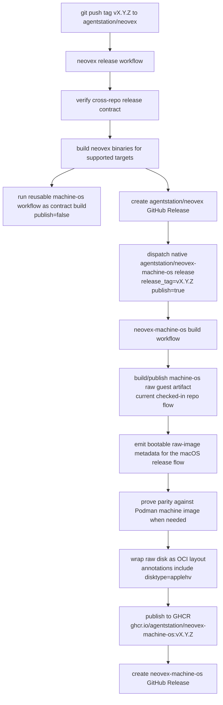
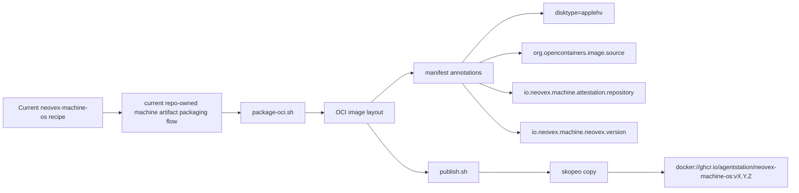
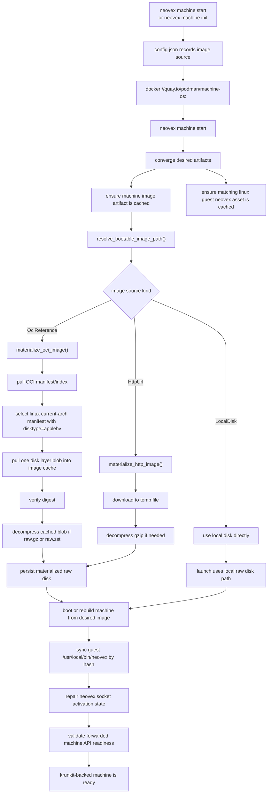
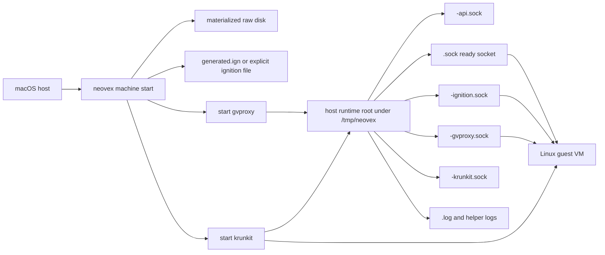
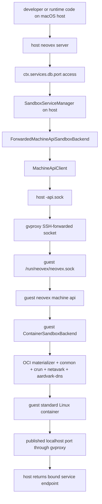
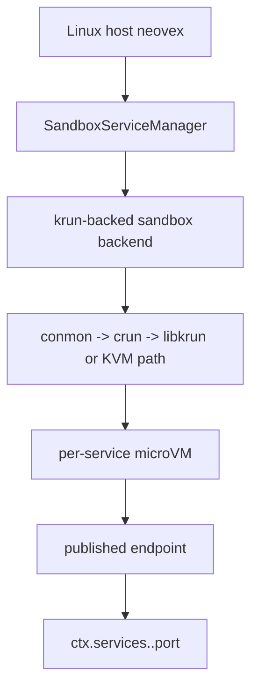

# macOS Machine Image And Control Flows

Current source-backed reference for how Neovex:

- publishes the macOS guest VM image
- version-links that image to a host `neovex` release
- pulls and materializes the guest image on a macOS host
- splits control-plane responsibility between the macOS host and the Linux
  guest

The release ownership and host-consumption paths below are the current
checked-in `neovex-machine-os` flow. The settled current macOS contract is
narrower: use Podman's published machine image by pinned immutable reference or
digest for the shipped macOS bring-up path, and layer Neovex guest bootstrap
on top. A Neovex-owned image remains later follow-on work rather than the
current shipped contract.

Reviewed against:

- `.github/workflows/release.yml`
- `/Users/jack/src/github.com/agentstation/neovex-machine-os/.github/workflows/build.yml`
- [crates/neovex-bin/src/machine/mod.rs](/Users/jack/src/github.com/agentstation/neovex/crates/neovex-bin/src/machine/mod.rs)
- [crates/neovex-bin/src/machine/manager.rs](/Users/jack/src/github.com/agentstation/neovex/crates/neovex-bin/src/machine/manager.rs)
- [crates/neovex-bin/src/machine/api.rs](/Users/jack/src/github.com/agentstation/neovex/crates/neovex-bin/src/machine/api.rs)
- [crates/neovex-bin/src/machine/client.rs](/Users/jack/src/github.com/agentstation/neovex/crates/neovex-bin/src/machine/client.rs)
- [crates/neovex-bin/src/machine/backend.rs](/Users/jack/src/github.com/agentstation/neovex/crates/neovex-bin/src/machine/backend.rs)
- [crates/neovex-bin/src/service/mod.rs](/Users/jack/src/github.com/agentstation/neovex/crates/neovex-bin/src/service/mod.rs)
- `/Users/jack/src/github.com/agentstation/neovex-machine-os/scripts/package-oci.sh`
- `/Users/jack/src/github.com/agentstation/neovex-machine-os/scripts/publish.sh`

## Overview

The current macOS architecture is a hybrid control plane:

- the macOS host owns the main Neovex server, runtime, storage, and
  `ctx.services.*` activation path
- the Linux guest owns a narrow machine API and standard-container execution
  lane for service workloads
- the current bring-up image comes from Podman's published machine-image
  stream on Quay, while `agentstation/neovex-machine-os` remains the later
  image-ownership track
- the host `neovex` release owns the desired Podman image reference/digest and
  the matching Linux guest `neovex` asset for the local host architecture

The checked-in macOS default image reference recorded when Neovex creates a
machine (`neovex machine init` or `neovex machine start` on a clean host) is
currently:

```text
docker://quay.io/podman/machine-os@sha256:02ce56eb3a353f3d909eeb6742db7052e13fcad01937ef9536d41178c4865000
```

Current contract note:

- Podman's published image is the current bring-up contract for macOS
- the host `neovex` release owns the desired image digest and the
  matching Linux guest `neovex` binary asset
- `neovex machine start` is the primary convergence path: cache missing
  artifacts, boot or rebuild from the desired image, sync the guest binary by
  hash, and validate the forwarded machine API before reporting success
- the default guest-binary path is the matching GitHub release asset cached
  under Neovex's machine cache; `NEOVEX_MACHINE_GUEST_BINARY` is an explicit
  developer/operator override only
- this Podman alignment is at the published-image and provider-behavior layer,
  not at the host-state layer; Neovex does not reuse Podman's machine records,
  VM disks, sockets, or local image store
- Neovex-owned image publishing remains later follow-on work instead of the
  current shipped macOS contract

## Flow 1: Current Checked-In Host Release To Guest Image Release



### What Each Repo Owns

- `agentstation/neovex`
  owns host CLI/server/runtime binaries and the host GitHub Release
- `agentstation/neovex-machine-os`
  owns the guest VM image build, GHCR publish, and machine-image GitHub
  Release

### Why The Flow Is Two-Phase

The host repo uses the machine-os workflow twice for different reasons:

1. reusable workflow call
   proves the cross-repo build contract against the exact host release inputs
2. native workflow dispatch in `agentstation/neovex-machine-os`
   lets the machine-image repo own its own GHCR publish and GitHub Release

That keeps the release ownership aligned with the repo boundary, which mirrors
Podman's `containers/podman` plus `containers/podman-machine-os` split.

## Flow 2: Current Checked-In Machine Image Packaging Flow



Current decision:

- Podman's published machine image is the current macOS bring-up contract
- Neovex guest bootstrap is layered on top of that image for the current
  closeout path
- the checked-in `neovex-machine-os` packaging flow above is therefore future
  image-ownership work, not the current shipped macOS contract
- any separate `fedora-bootc` image pipeline work in
  `agentstation/neovex-machine-os` remains a future supply-side direction, not
  the current shipped macOS contract

Current implementation note:

- as of 2026-04-16, the checked-in macOS default already points at the pinned
  immutable Podman digest above
- the full start-time convergence contract has now been proved end to end,
  including guest-binary sync, forwarded machine-API readiness, host service
  control, runtime `ctx.services.<name>.port`, and the supported recreate
  drill on isolated roots

### Important Packaging Contract

The host machine manager does not pull an arbitrary OCI image and hope it is a
disk. It looks for a specific artifact shape:

- operating system: `linux`
- architecture: current host-compatible machine arch
- manifest annotation: `disktype=applehv` on the current macOS krunkit path
- exactly one disk layer
- disk layer title suffix such as `.raw`, `.raw.gz`, or `.raw.zst`

That packaging contract is what lets the host treat GHCR as a versioned VM
image registry instead of inventing a separate image service. The provider
capability contract owns that annotation value so the staged Windows path can
select `wsl` without changing the current macOS rule.

## Flow 3: How `neovex` Pulls The VM Image On macOS



### Where The Image Comes From

By default on the current macOS contract, it comes from Podman's
published machine-image stream:

```text
quay.io/podman/machine-os
```

The host supports three source kinds:

- OCI reference
- `http(s)` URL
- local raw disk path

The OCI reference is the canonical release path. The target contract is an
immutable pinned Podman digest owned by the host `neovex` release, not a
floating tag.

### Where The Image Lands On Disk

For a machine named `default`, Neovex reserves:

- cache directory:
  `cache/images/`
- guest Linux `neovex` asset cache:
  `cache/guest-neovex/`
- materialized bootable raw disk:
  `data/default/images/default.raw`

The manager reuses `default.raw` if it already exists.

Current implementation note:

- the checked-in machine manager now uses that split directly:
  - config under `XDG_CONFIG_HOME`
  - lifecycle state and locks under `XDG_STATE_HOME`
  - durable VM data under `XDG_DATA_HOME`
  - redownloadable machine-image and guest-binary artifacts under
    `XDG_CACHE_HOME`
- the cache-sharing target is **across Neovex machines only**; Neovex should
  not couple itself to Podman's or Docker's mutable local stores just because
  the current macOS bring-up image comes from Podman's published image stream

## Flow 4: macOS Machine Launch Plumbing



### Socket Roles

- `<machine>-ignition.sock`
  first-boot ignition delivery
- `<machine>.sock`
  machine-ready signal
- `<machine>-api.sock`
  host-local forwarded guest machine API
- `<machine>-gvproxy.sock`
  gvproxy networking socket used by krunkit virtio-net
- `<machine>-krunkit.sock`
  krunkit REST/control endpoint

### Transport Reality

`vsock` exists on macOS here, but its role is narrow:

- first-boot bootstrap
- machine-ready signaling

It is not the generic host API transport.

The host control path uses:

- `gvproxy`
- SSH-backed forwarded Unix socket
- guest target socket: `/run/neovex/neovex.sock`

## Flow 5: Host Runtime To Guest Service Execution



### Current Responsibility Split

Host:

- main Neovex API
- runtime execution
- storage
- `ctx.services.*` activation
- service catalog and manager orchestration

Guest:

- machine API
- image-backed service sandbox execution through in-process OCI materialization
- standard-container runtime binaries
- published port plumbing for service workloads

This is intentionally not "guest Neovex owns the full product surface". The
current architecture keeps the authoritative Neovex server on the macOS host
and forwards only the service-execution seam into the guest.

## Flow 6: Linux Production Contrast



macOS is different:

- one Linux machine VM per developer environment
- guest standard containers for service workloads
- host Neovex runtime/server remains on macOS

Linux production:

- no outer machine VM
- service workloads can be real per-service microVMs

## Proof Helpers

The repo now owns three checked-in macOS proof collectors for this flow:

- `make collect-neovex-machine-guest-proof`
  captures guest-image and guest machine-API proof through `neovex machine ssh`
- `make collect-neovex-machine-service-proof`
  captures host `<machine>-api.sock` health/capabilities, direct forwarded
  machine-API sandbox listing, host `neovex service up/list/inspect/ps/logs/down`,
  and an optional localhost published-port probe
- `make collect-neovex-homebrew-cask-proof`
  packages the local release binary plus bundled `libexec/gvproxy` into an
  isolated proof cask, installs it under a temporary Homebrew tap/token, then
  captures host `neovex --version`, packaged-helper discovery, `machine init`,
  `machine start`, `machine status`, guest `neovex --version`, nested guest
  machine-API proof, guest SSH, and `machine stop` proof without touching the
  user's shipped `neovex` cask token or default machine roots. The default
  collector path uses the tagged guest release asset; `--guest-binary` is only
  an explicit override for local guest-build debugging

The repo also now owns deterministic verifiers for the guest, service, and
Homebrew/cask proof harnesses, including
`make verify-neovex-homebrew-cask-proof-helper` for the packaged macOS path.
Those helper verifiers are the CI-safe automation lane for the harness logic
itself; the full `krunkit` guest boot remains a checked-in local proof lane
rather than a GitHub-hosted runner contract.

The current real-host cask-proof bundle at
`/tmp/neovex-d4a-proof-release-asset` shows `guest.binary.override <none>`,
host `neovex 0.1.11`, guest `neovex 0.1.11`,
`runtime.helper_binaries.gvproxy:
/opt/homebrew/Caskroom/neovex-dev/0.1.11/libexec/gvproxy`, forwarded
`machine_api.reachable: true`, nested guest machine-API `HTTP/1.1 200 OK`
proof plus `protocol_version: v1alpha2`, and `/Users` virtiofs reachability,
then cleans up the temporary `local/neovex-proof` tap and `neovex-dev` cask
token afterward.
Current status-output note: `neovex machine status` now includes a
`guest_binary_contract` block for the macOS host-managed path so operators can
see the desired guest-binary provenance (`release-asset` vs
`explicit-override`), desired version/hash/cache path, and, when the machine is
running, the observed guest `/usr/local/bin/neovex` version/hash too.
The current no-ambient-`PATH` hardening rerun at
`/tmp/neovex-d4a-proof-no-path` revalidated that same packaged/Homebrew
contract after helper resolution stopped trusting shell `PATH`; the bundle
again recorded packaged `gvproxy`, guest `neovex 0.1.10`, machine API
readiness, and `/Users` virtiofs reachability before cleanup.
The current Podman-default-directory rerun at
`/tmp/neovex-d4a-proof-podman-dirs` then revalidated the same contract after
the named fallback directories were aligned to Podman's darwin
`helper_binaries_dir` defaults; the bundle again recorded packaged
`gvproxy`, guest `neovex 0.1.10`, machine API readiness, and `/Users`
virtiofs reachability before cleanup.

The current checked-in isolated proof project for that collector is
intentionally `build:`-backed, not `image:`-backed. The validated real-host
bundle at
`/tmp/neovex-mac-buildproof.nDZ0P4/service-proof-buildstart-pathfix-teardownfix-refreshfix-stalepidfix-crlffix`
shows `service config` lowering with `source.kind: build`, a resolved
`dockerfile_path`, guest machine-API `service-sandboxes.build-start:
available=true`, successful `service up/list/inspect/ps/logs/down`, and
localhost `HTTP/1.1 200 OK` on `http://127.0.0.1:18080/healthz`.

The current real-host `serve` auto-start proof bundle at
`/tmp/neovex-mac-closeout.FNcv0I/serve-proof-d4c-autostart` then closes the
next host-resident DX seam on the same pinned Podman contract: the machine was
stopped before startup, `neovex serve` on port `18084` brought it back to
`running`, `/health` returned `200 {"ok":true}`, `services:activate` returned
`18080`, localhost `http://127.0.0.1:18080/healthz` returned `200 ok`, native
`/ws?tenant_id=demo-ws` captured an initial empty `subscription_result`
followed by a pushed `subscription_result` after an HTTP document insert, and
tenant deletion withdrew the published localhost service again.

The repo also owns one checked-in local guest-binary build helper for the same
contract:

- `make build-neovex-machine-guest-binary`
  builds the matching Linux guest `neovex` artifact into
  `target/<triple>/release/neovex` on the current developer host; use it only
  with an explicit `NEOVEX_MACHINE_GUEST_BINARY=...` override when intentionally
  testing a local guest build instead of the tagged release asset cache

The repo also owns two checked-in operator drill helpers for the same contract:

- `make collect-neovex-machine-diagnostics`
  captures the persisted config/state records plus the flat short runtime-root
  socket, pid, and log inventory for an isolated machine root
- `make recreate-neovex-machine`
  performs the supported stop/remove/init/start repair drill on isolated roots;
  by default it follows the current pinned machine-image contract, while
  `IMAGE=...` remains an explicit diagnostic override only

## Current Reliability Notes

- Host convergence stages the guest binary under
  `/usr/local/bin/neovex`, backed by FCOS's writable `/var/usrlocal`, then
  repairs `neovex.socket` activation before it trusts the forwarded machine
  API. The active macOS contract does not rely on Ignition to fetch or version
  that binary, and it does not expect macOS users to build a Linux guest
  binary locally; the normal path is the matching cached release asset.
- The supported Homebrew Apple Silicon packaging path keeps `krunkit` as an
  explicit formula dependency and now prefers a bundled `libexec/gvproxy`
  beside the packaged `neovex` binary, matching Podman's "bundle helper,
  don't require Podman as a dependency manager" installer shape. Helper
  resolution now follows the same general priority as Podman's darwin
  `helper_binaries_dir` search: explicit binary override, optional
  helper-directory override
  (`NEOVEX_MACHINE_HELPER_BINARY_DIR`), packaged helper locations, known
  Podman/Homebrew helper locations, without ambient `PATH` fallback for
  machine helpers.
- Manual macOS tarball installs need to preserve the same relative
  `prefix/bin/neovex` plus `prefix/libexec/gvproxy` layout that the cask
  provides, or set `NEOVEX_MACHINE_HELPER_BINARY_DIR` explicitly. Moving only
  the `neovex` binary into `/usr/local/bin` is not a supported machine
  install shape because it strands the bundled helper.
- Machine-API `list` and `inspect-current` refresh only sandboxes that may
  still be live (`starting`, `ready`, `not_ready`, `stopping`). Historical
  stopped sandboxes are intentionally not re-inspected during these reads so a
  reused host port does not let old cleanup paths withdraw the active gvproxy
  forward.
- Both the guest standard-container backend and the krun backend now treat a
  surviving pidfile without a live process as stale state. If shutdown was not
  requested, that state collapses to `failed` instead of lingering in
  `starting`, which keeps post-restart `service up` from reporting
  `already_running` for dead sandboxes.
- The checked-in service-proof collector now waits for `service inspect` to
  report `status: ready`, retries the localhost published-port probe, and
  normalizes HTTP CRLF headers before matching the `200 OK` status line. That
  keeps the macOS proof bundle deterministic against real host responses.
- The deterministic proof helper for that collector now mirrors the live macOS
  contract instead of the earlier simplified image-backed fixture: it renders a
  `build:`-backed compose service and a `v1alpha2` guest capability payload
  with `service-sandboxes.build-start` available, so regressions in the
  build-backed lane are caught before the next real-host run.
- When `neovex serve` loads a macOS container-backed Compose project without an
  injected machine-API client, it now auto-starts the initialized default
  machine under the existing machine lock before wiring the forwarded guest
  sandbox backend. That keeps `serve` aligned with the documented "machine
  start is the convergence path" contract instead of requiring a manual
  pre-start step.

## Practical Summary

If you want the shortest accurate explanation:

1. A `neovex` host release owns two desired macOS artifacts: a pinned Podman
   machine-image reference or digest and a matching Linux guest `neovex`
   binary asset for the local host architecture.
2. `neovex machine init` records the machine contract; the checked-in default
   currently uses Podman's machine image stream on Quay. `neovex machine
   start` now also performs that same initialization step automatically when
   no machine exists yet, and `neovex machine init --now` remains the explicit
   Podman-style combined shortcut.
3. `neovex machine start` checks the local caches, pulls any missing image or
   guest-binary artifact, and materializes the bootable raw disk.
4. If the machine's recorded base image already matches the desired digest, the
   host reuses the machine; if it does not match, the host performs a
   controlled rebuild or recreate from the desired image.
5. After boot, the host hash-checks and syncs
   `/usr/local/bin/neovex` inside the guest. On FCOS that is backed by the
   writable `/var/usrlocal/bin/neovex` path with executable labeling.
6. If the host-managed macOS contract does not already have an explicit SSH
   identity recorded, `neovex machine start` auto-generates a machine-owned
   keypair under the Neovex machine data root before it boots the guest, so
   first-run SSH and guest-binary sync do not require a separate manual key
   provisioning step.
7. The same host convergence step then repairs guest socket activation
   (`daemon-reload`, clears failed `neovex` units, removes any stale
   `/run/neovex/neovex.sock`, and starts `neovex.socket`) before validating
   the forwarded machine API, so a fresh Podman-image boot does not get stuck
   on a pre-sync `start-limit-hit`.
8. On macOS container-backed Compose projects, `neovex serve` now reuses that
   same convergence path: if the initialized default machine is stopped, the
   host starts it before it wires the forwarded guest backend.
9. The host Neovex server talks to the guest machine API through a forwarded
   Unix socket, and the guest starts standard Linux containers for declared
   services.
