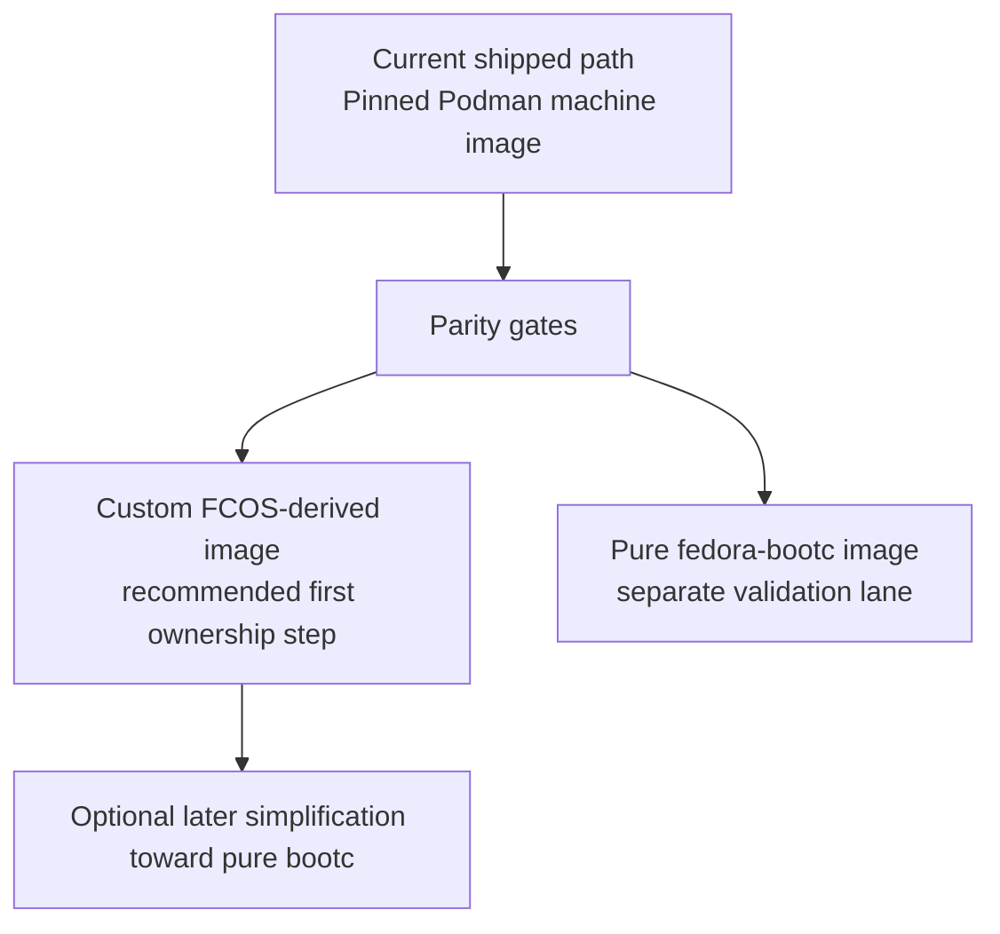

# Bootc Adoption Evaluation

Research evaluation for adopting bootc-based machine images in Neovex.

Date: 2026-04-17

## Executive Summary

The upstream direction is real, but the earlier draft overstated how much of it
is already true for Neovex.

What is clearly verified:

- Fedora CoreOS (FCOS) is converging on the bootc supply chain. Fedora accepted
  building FCOS from a `Containerfile` `FROM` `fedora-bootc` for Fedora 43.
- FCOS is also converging on OCI-delivered updates. Fedora accepted the OSTree
  to OCI transport move for Fedora 42.
- Podman already uses `bootc` inside its guest for `podman machine os apply`
  and `podman machine os upgrade`.
- Podman's machine image remains a customized FCOS image layered through a
  `Containerfile`.
- Neovex's current shipped macOS contract is still the pinned Podman machine
  image plus Neovex host-managed bootstrap and guest-binary sync.

What is **not** verified:

- That FCOS 43 has already switched its runtime lifecycle from
  `rpm-ostree`/Zincati to `bootc`.
- That pure `fedora-bootc` is already a drop-in substitute for the current
  Neovex macOS contract.
- That current `neovex-machine-os` artifacts preserve all FCOS-specific
  assumptions in Neovex's bootstrap path.
- That composefs integrity is a current Neovex advantage; the checked-in
  builder config currently disables it.

### Recommendation

Keep the shipped macOS path Podman-aligned for now.

Treat `agentstation/neovex-machine-os` as the validation and ownership lane, but
do **not** switch the default macOS guest image to pure `fedora-bootc` until
Neovex proves parity on:

- bootstrap delivery
- `core` user / SSH flow
- `/usr/local/bin/neovex` execution semantics
- ready/vsock signaling
- forwarded machine API readiness
- virtiofs mount behavior
- SELinux labeling

If Neovex wants a first step toward owning the macOS guest image, the lower-risk
path is a **custom FCOS-derived image** that preserves current FCOS/Ignition
semantics while moving to a Neovex-owned build and release pipeline.

Pure `fedora-bootc` remains a plausible follow-on path, but it is not yet
proven in this repo.

## Current Neovex State

### Shipped macOS contract

The current shipped macOS machine contract is still Podman-aligned:

- `crates/neovex-bin/src/machine/mod.rs:57-79` pins macOS `Krunkit` to
  `quay.io/podman/machine-os@sha256:...`
- `crates/neovex-bin/src/machine/mod.rs:119-131` treats both Podman's image and
  the Neovex image repo as part of the host-managed image contract on macOS
- `docs/reference/macos-machine-flow.md` explicitly says the current macOS
  bring-up path is Podman's published machine image by pinned immutable
  reference, with Neovex bootstrap layered on top

```mermaid
flowchart LR
    Host["macOS host: neovex"] -->| "boot pinned Podman machine image" | Guest["Linux guest: Podman FCOS image"]
    Host -->| "Ignition file + SSH identity" | Guest
    Host -->| "hash-sync /usr/local/bin/neovex" | Guest
    Host -->| "validate forwarded machine API" | Guest
```

### Current bootstrap assumptions

The checked-in bootstrap flow is explicitly FCOS-shaped:

- `crates/neovex-bin/src/machine/bootstrap.rs:10-17` emits Ignition 3.2.0,
  expects a `core` user, and places the guest binary at `/usr/local/bin/neovex`
- the same file records the important FCOS-specific assumption that `/usr/local`
  is a writable symlink to `/var/usrlocal` and has the right executable label
- `crates/neovex-bin/src/machine/manager.rs:625-668` requires an SSH identity so
  Neovex can stage the guest binary and validate the forwarded machine API
- `crates/neovex-bin/src/machine/manager.rs:1290-1292` explicitly warns that on
  macOS, generic `fedora-bootc` raw images are not a supported substitute for
  the current FCOS/libkrun/Ignition path

### Current OS update behavior

Neovex's `machine os apply` and `machine os upgrade` are currently **host-side
disk replacement**, not in-guest bootc transitions:

- `crates/neovex-bin/src/machine/mod.rs:653-708` rewrites
  `config.guest.image_source`
- invalidates the materialized machine disk
- resets machine state
- optionally restarts the machine

This is simpler than Podman's in-guest `bootc switch`, but it means full image
replacement rather than differential in-place updates.

### Distribution plan state

The active distribution plan already moved the Neovex image build pipeline in a
bootc direction:

- `docs/plans/distribution-plan.md:393-403` describes a `fedora-bootc:42`
  machine image built via `podman build` and `bootc-image-builder --type raw`
- `docs/plans/distribution-plan.md:690-703` still keeps the shipped macOS
  contract pinned to Podman's machine image until a Neovex-owned image preserves
  the same FCOS/Ignition/libkrun semantics
- `docs/plans/distribution-plan.md:778-780` records the CI migration from
  `rpm-ostree + custom-coreos-disk-images` to `bootc-image-builder`

### Current `neovex-machine-os` reality

The checked-in `agentstation/neovex-machine-os` repo is important because it
shows where Neovex actually stands today, not where the earlier research draft
assumed it stood.

Verified repo state:

- `README.md:3-4` says the guest image is built on Fedora bootc
- `images/README.md:8-13` says the recipe is built from `fedora-bootc:42` and
  expects first-boot bootstrap from Ignition plus host-injected units
- `images/build-common.sh:24-38` installs container tooling, `openssh-server`,
  and `socat`
- that same file does **not** explicitly install `ignition`,
  `ignition-dracut`, or `cloud-init`
- `images/bootc-image-builder.toml:5-6` sets
  `ostree.prepare-root.composefs=0`, which disables composefs at boot

This means:

- the current repo does prove Neovex is already using bootc for image building
- it does **not** prove that the current image recipe preserves the full FCOS
  bootstrap contract
- it does **not** support claiming composefs as a current Neovex security
  property
- the checked-in README's `cloud-init` statement is out of sync with the checked
  build script

## Verified Upstream Findings

### Fedora / FCOS

#### FCOS is moving closer to bootc

Fedora accepted two different but related changes:

1. `BuildFCOSUsingContainerfile`
   FCOS is built from a `Containerfile` `FROM` `fedora-bootc` for Fedora 43.

2. `CoreOSOstree2OCIUpdates`
   FCOS switches update delivery from the OSTree repo to OCI transport.

Those are both real and important.

#### Important nuance: transport convergence is not the same as lifecycle convergence

The earlier draft was too strong here.

Fedora's accepted `CoreOSOstree2OCIUpdates` change explicitly says:

- FCOS will pull updates from Quay instead of the OSTree repo
- this is preliminary work toward bootc
- FCOS will "keep using `rpm-ostree` for updates (and not yet `bootc`)"

Fedora CoreOS major-changes docs tell the same story: starting in Fedora 42,
FCOS updates are delivered through OCI images, but the change is described as a
transport change.

So the correct statement is:

- **Verified**: FCOS is converging on bootc supply chain and OCI transport
- **Not verified**: FCOS has already fully switched to bootc runtime lifecycle

#### FCOS still carries semantics Neovex currently depends on

Current Neovex bootstrap assumptions line up with FCOS conventions:

- default `core` user
- Ignition-first provisioning model
- FCOS-specific `/usr/local` behavior noted in `bootstrap.rs`

That is why "FCOS-derived custom image" is lower risk than jumping immediately
to pure `fedora-bootc`.

### Podman

#### Podman machine already uses bootc for guest OS rebases

This part of the earlier draft was correct.

Verified from both docs and source:

- `containers/podman/pkg/machine/os/ostree.go:31-46` uses `sudo bootc switch`
  in `Apply()`
- `containers/podman/pkg/machine/os/ostree.go:49-138` uses `bootc upgrade` or
  `bootc switch` in upgrade flows
- `docs.podman.io` for `podman-machine-os-apply` explicitly says the applying of
  the OCI image is done by `bootc` and specifically `bootc switch`

#### Podman's machine OS remains FCOS-based

Current Podman documentation still describes the default machine OS as a
customized Fedora CoreOS / rpm-ostree-based distribution, except for WSL.

That matches current source:

- `containers/podman-machine-os/podman-image/Containerfile.COREOS:1-8`
  `FROM ${FCOS_BASE_IMAGE}`
- `containers/podman-machine-os/podman-image/build_common.sh` layers Podman
  packages and configuration on top

The important architectural point is:

- Podman is not choosing between "FCOS" and "bootc" as mutually exclusive
  things
- Podman is using **Containerfile-based image ownership** while still preserving
  the guest semantics it needs from FCOS

That is the closest upstream analogue to Neovex's current needs.

#### Current Podman macOS default is libkrun

Current Podman docs list the macOS default machine provider as `libkrun`.

Verified from:

- `docs/source/markdown/podman-machine.1.md`
- `pkg/machine/provider/platform_darwin.go`

That supports the general long-term alignment story with `krunkit`, but it does
not by itself prove Neovex's full custom guest contract.

#### `podman-bootc` proves upstream interest, not Neovex parity

Upstream prior art exists and is worth keeping, but it should be described
precisely:

- `bootc-dev/podman-bootc` PR `#65` ("Macos switch to krunkit") merged on
  **2024-08-22**
- `bootc-dev/podman-bootc` issue `#44` ("Add krunkit support on MacOS") closed
  as completed on **2025-06-05**

That is good evidence that `krunkit` plus bootc is a real upstream path. It is
still not proof that Neovex's own bootstrap, SSH, vsock, and forwarded API
contract already works on pure `fedora-bootc`.

#### WSL remains a separate path

Podman docs explicitly exclude WSL-based machines from `podman machine os apply`
and tell users to update them inside the guest with package-manager flows.

That matches Neovex's current model:

- `Wsl2` uses a tar image and shell bootstrap
- it is not on the same path as the raw-disk `Krunkit` machine flow

### bootc

#### bootc does support the image-native workflow the earlier draft described

The high-level bootc model in the draft is correct:

- OCI image as the OS artifact
- `bootc upgrade` for staged A/B style updates
- `bootc switch` to change tracked image
- rollback support

Verified from the official bootc docs:

- `bootc` introduction
- `Managing upgrades`
- `bootc-switch`

#### bootc does not make users, SSH, or metadata tooling magically appear

This is one of the most important corrections.

Official bootc docs say:

- bootc itself is not directly about configuring users or SSH
- generic base images may include metadata tools such as cloud-init or Ignition,
  or you may install them in derived images
- custom logic via units or other first-boot mechanisms is also valid

That supports two conclusions:

- pure bootc **can** be made to work for Neovex
- but Neovex must explicitly own that bootstrap story rather than assuming it is
  already provided

#### `/usr/local` semantics differ between bootc guidance and current Neovex assumptions

Official bootc filesystem guidance recommends that in bootc-oriented systems
`/usr/local` be a regular directory by default. By contrast, current Neovex
bootstrap explicitly depends on FCOS's `/usr/local -> /var/usrlocal` behavior and
labeling.

This is a real block for "pure bootc is low-friction":

- it is solvable
- but it is not free
- it must be validated in the actual Neovex guest path

#### bootc auto-updates are simpler than Zincati

The earlier draft was directionally right but too absolute.

Verified:

- bootc ships `bootc-fetch-apply-updates.service` and a companion timer
- upstream's default timer is daily
- the service checks for updates, downloads them, and reboots

But:

- bootc issue `#459` ("Fold Zincati features into bootc") was closed
  `not_planned`
- so bootc should be treated as a simpler update mechanism, not a feature-for-
  feature Zincati replacement

#### composefs is recommended, not automatic

bootc filesystem guidance strongly recommends the ostree composefs backend, but
it is a configuration choice.

That matters because Neovex currently disables it in
`images/bootc-image-builder.toml`.

So composefs is a **potential** future Neovex advantage, not a current verified
property of the checked-in Neovex image recipe.

## Claim Audit

| Claim from earlier draft | Verdict | Notes |
|---|---|---|
| FCOS 43 is built from `fedora-bootc` via `Containerfile` | Verified | Accepted Fedora 43 change |
| FCOS 43 uses `bootc` for OS lifecycle management | Not verified | Fedora change says OCI transport, still `rpm-ostree` for updates |
| Podman machine uses `bootc switch` / `bootc upgrade` | Verified | Confirmed in current docs and source |
| Podman machine OS remains FCOS layered via `Containerfile` | Verified | Confirmed in `podman-machine-os` |
| Current Podman macOS default is `libkrun` | Verified | Confirmed in current docs/source |
| krunkit + bootc is proven upstream | Partially verified | `podman-bootc` merged macOS krunkit support, but that is not Neovex parity proof |
| Pure bootc is ready to replace Neovex's current macOS path | Not verified | Local bootstrap and image-recipe gaps remain |
| Composefs integrity is already part of Neovex's current machine image | Not verified | Current builder config disables composefs |
| Neovex `machine os apply` does in-guest `bootc switch` like Podman | False | Neovex currently does host-side disk replacement |
| Windows can be treated the same way as macOS/Linux in current Neovex plan | False | Current WSL2 path is separate tar + shell bootstrap |

## Option Analysis For Neovex

### Option 1: Keep the shipped Podman-aligned path

This is the current production-quality path for macOS development machines.

Benefits:

- already matches current Neovex startup and bootstrap assumptions
- no ambiguity about FCOS/Ignition/libkrun behavior
- no immediate risk to the current machine bring-up flow

Costs:

- Neovex does not own the guest OS image content
- customizations remain constrained by the Podman contract
- no direct step toward in-guest differential updates yet

### Option 2: Adopt a Neovex-owned FCOS-derived image first

This is the lower-risk ownership step.

Meaning:

- keep FCOS guest semantics
- keep Ignition and the current `core`-user shape
- keep Podman-aligned macOS guest behavior
- move the image build, release, provenance, and OCI packaging under Neovex

Why this is attractive:

- it matches the current bootstrap contract much more closely
- it still benefits from the same ecosystem convergence that motivated the
  earlier draft
- because FCOS is itself moving closer to bootc and Containerfile builds, this
  is not "staying behind"; it is choosing the least disruptive entry point

Main work:

- prove the Neovex-owned image preserves the existing boot path
- remove current doc/repo drift in `neovex-machine-os`
- make the macOS shipped contract switch from Podman's pinned image to Neovex's
  pinned image only after parity is proven

### Option 3: Jump directly to pure `fedora-bootc`

This is still plausible, but it is not ready to recommend as the default path.

What Neovex would need to own explicitly:

- install and validate Ignition, or replace it with another first-boot mechanism
- define how SSH keys arrive
- create and manage the `core` user, or stop depending on it
- decide the final `/usr/local/bin/neovex` strategy and its SELinux labeling
- decide whether composefs stays off or becomes part of the security baseline
- validate the entire `krunkit` + vsock + forwarded machine API path end to end

This is why the earlier recommendation to "skip the hybrid path immediately" was
too aggressive.

## Recommended Path

Use a staged decision funnel instead of a single leap.



### Phase 1: Close the repo/documentation drift

Before any product decision, Neovex should make the checked-in machine image repo
match reality:

- fix the `cloud-init` claim in `neovex-machine-os/README.md`
- make the intended bootstrap contract explicit: FCOS semantics, explicit
  Ignition installation, or alternate provisioning
- make the composefs choice explicit instead of leaving it implied by the
  previous research draft

### Phase 2: Prove parity gates on macOS

Do not change the shipped default image until all of these are true with a
Neovex-owned image:

- `krunkit` boots the guest reliably
- the guest consumes bootstrap data on first boot
- SSH comes up for the expected user
- Neovex can sync the guest binary
- `ready.service` reaches the host over vsock
- the forwarded machine API becomes healthy
- virtiofs mounts work with the intended SELinux treatment
- the guest binary path is executable with the intended `/usr/local` strategy

### Phase 3: Pick the ownership step

If the goal is the fastest safe move to Neovex-owned images, choose:

- **custom FCOS-derived image**

If the goal is longer-term simplification and Neovex is willing to own the
bootstrap contract more directly, continue:

- **pure `fedora-bootc` prototype**

### Phase 4: Decide whether to adopt in-guest bootc transitions

Only after the guest image contract is solid should Neovex decide whether to
move from host-side disk replacement to in-guest `bootc switch` / `bootc
upgrade`.

That is a separate change from image ownership and should be planned as such.

## Cross-Platform Implications

| Surface | Current state | bootc implication |
|---|---|---|
| macOS developer machine | Highest sensitivity; raw disk + `krunkit` + Ignition + host-managed sync | This is the main decision surface |
| Linux production workload | krun/libkrun microVM service isolation | Largely independent of the machine-image decision |
| Windows developer machine | WSL2 tar + shell bootstrap | Separate from current bootc/raw-disk discussion |
| Future Windows Hyper-V path | Not current Neovex path | Could use bootc-generated disk images later, but that is future scope |

### Linux production note

Nothing in this audit suggests that Neovex should change the current Linux
production service-isolation architecture because of bootc research.

The machine-image decision is mainly about:

- macOS developer machines
- future guest-image ownership
- update and supply-chain simplification

It is not, by itself, a reason to replace the existing krun/libkrun service
model.

## Final Recommendation

The earlier draft was right about the ecosystem trend and wrong about Neovex's
readiness to exploit all of it immediately.

The best current recommendation is:

1. Keep the shipped macOS default on the pinned Podman machine image.
2. Continue `neovex-machine-os` as the image-ownership and validation lane.
3. Make the first ownership target a custom FCOS-derived image unless the pure
   `fedora-bootc` prototype proves full Neovex parity first.
4. Treat pure bootc as a follow-on optimization, not a currently proven default.

That keeps Neovex aligned with where Fedora and Podman are going, while still
respecting what the checked-in Neovex code actually requires today.

## Sources

### Local Neovex sources

- `crates/neovex-bin/src/machine/mod.rs`
- `crates/neovex-bin/src/machine/manager.rs`
- `crates/neovex-bin/src/machine/bootstrap.rs`
- `docs/reference/macos-machine-flow.md`
- `docs/plans/distribution-plan.md`
- `/Users/jack/src/github.com/agentstation/neovex-machine-os/README.md`
- `/Users/jack/src/github.com/agentstation/neovex-machine-os/images/README.md`
- `/Users/jack/src/github.com/agentstation/neovex-machine-os/images/build-common.sh`
- `/Users/jack/src/github.com/agentstation/neovex-machine-os/images/bootc-image-builder.toml`

### Fedora / FCOS

- [Build Fedora CoreOS using Containerfile](https://fedoraproject.org/wiki/Changes/BuildFCOSUsingContainerfile)
- [Move Fedora CoreOS updates from OSTree to OCI](https://fedoraproject.org/wiki/Changes/CoreOSOstree2OCIUpdates)
- [Fedora CoreOS major changes](https://docs.fedoraproject.org/en-US/fedora-coreos/major-changes/)

### Podman / containers

- [podman-machine-os-apply](https://docs.podman.io/en/latest/markdown/podman-machine-os-apply.1.html)
- [podman-machine-os-upgrade](https://docs.podman.io/en/latest/markdown/podman-machine-os-upgrade.1.html)
- [podman-machine](https://docs.podman.io/en/latest/markdown/podman-machine.1.html)
- `containers/podman/pkg/machine/os/ostree.go`
- `containers/podman/docs/source/markdown/podman-machine.1.md`
- `containers/podman/docs/source/markdown/podman-machine-os-apply.1.md`
- `containers/podman-machine-os/podman-image/Containerfile.COREOS`
- `containers/podman-machine-os/podman-image/build_common.sh`
- [podman-bootc PR #65](https://github.com/bootc-dev/podman-bootc/pull/65)
- [podman-bootc issue #44](https://github.com/bootc-dev/podman-bootc/issues/44)

### bootc

- [bootc introduction](https://bootc.dev/bootc/)
- [Managing upgrades](https://bootc.dev/bootc/upgrades.html)
- [bootc-switch](https://bootc.dev/bootc/man/bootc-switch.html)
- [bootc-fetch-apply-updates.service](https://bootc.dev/bootc/man/bootc-fetch-apply-updates.service.5.html)
- [Filesystem](https://bootc.dev/bootc/filesystem.html)
- [Users and groups](https://bootc.dev/bootc/building/users-and-groups.html)
- [bootc issue #459: Fold Zincati features into bootc](https://github.com/bootc-dev/bootc/issues/459)
- [bootc issue #362: Missing SELinux labeling on some files when built on SELinux-disabled hosts](https://github.com/bootc-dev/bootc/issues/362)

### Notes on source interpretation

- Fedora's FCOS change pages are the primary source for what is accepted and how
  Fedora describes the rollout. They support strong claims about build and
  transport convergence, but not yet a blanket claim that FCOS has fully moved
  to bootc runtime lifecycle management.
- Podman's current docs and source are the primary source for `podman machine`
  behavior.
- The earlier draft's `podman-bootc` timing was off. The current corrected
  document uses the exact upstream GitHub dates for PR `#65` and issue `#44`.
- bootc's official docs are the primary source for what a generic bootc system
  does and does not provide by default.
