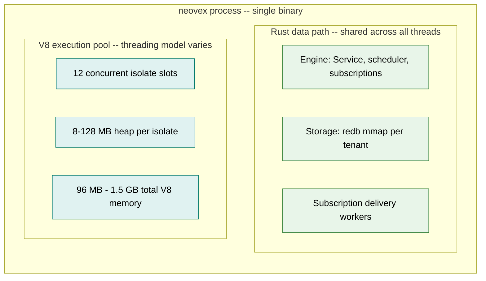
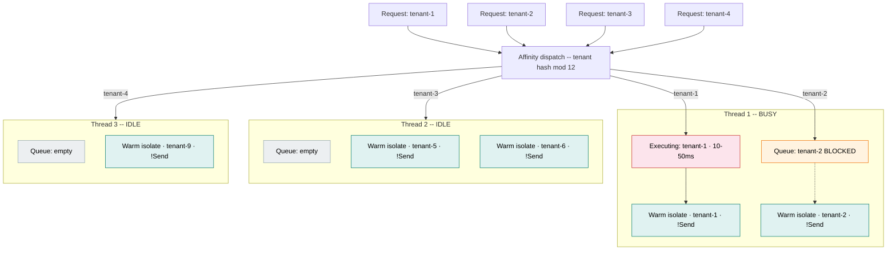
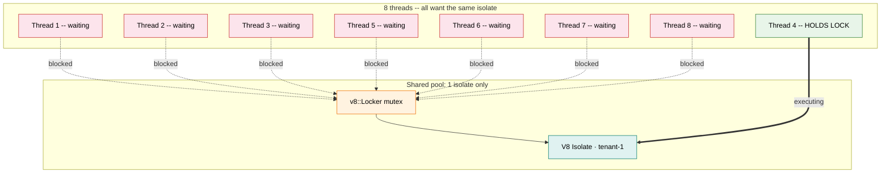
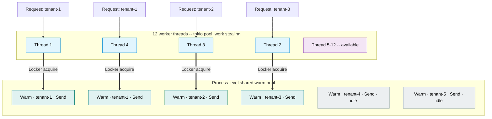

# Runtime Execution Architecture Rationale

Why Neovex embeds V8 via a `deno_core` fork, why the workerd multi-threaded
warm-isolate model is not pursued as-is, and what future paths exist.

This document captures the evaluated tradeoff space as of 2026-04-06 so that
future contributors do not re-derive these decisions from scratch. It is a
research rationale, not an execution plan — see `docs/plans/README.md` for
active plans.

---

## The Decision We Made

Neovex embeds V8 through a forked `deno_core` (`agentstation/deno_core`) and a
forked `rusty_v8` (`agentstation/rusty_v8`). The forks add V8 Locker API
support for cooperative multi-isolate scheduling on shared worker threads.

User-defined functions run inside V8 isolates that are **thread-pinned** —
each isolate lives on the worker thread that created it and does not migrate
between threads.

---

## Execution Model Diagrams

All diagrams assume an OVHcloud Advance-1 reference server: AMD EPYC 4244P
(6 cores, 12 threads), 128 GB RAM, ~120 GB available after OS and base
process overhead. Production mix: 300-500 tenants, 50-100 active, 12
concurrent V8 isolate slots.

### 1. Process memory layout (shared context for all models)

The Neovex process has two major memory regions: the Rust data path (engine,
storage, subscriptions) and the V8 execution pool. The data path memory
scales with tenant count and data size. The V8 pool memory scales with
concurrent isolate count and per-isolate heap size. The threading model only
affects how the V8 pool region is organized.



**Memory budget on 128 GB server:**

| Region | Size | Scales with |
|--------|------|-------------|
| OS + base process | ~8 GB | Fixed |
| redb mmap (all tenants) | 20-80 GB | Tenant count x data size |
| Materialized read surfaces | 0-8 GB | Active tenant count x 16 MB max each |
| Subscription state | 0.5-2 GB | Active subscription count |
| V8 isolate heaps | 0.1-1.5 GB | Concurrent isolate count x heap size |
| **Available headroom** | **28-91 GB** | |

RAM is the primary scaling constraint. The V8 pool is a small fraction
of total memory but CPU-intensive when active.

### 2. Thread-pinned model (current) -- head-of-line blocking

Each of 12 worker threads owns a local isolate pool. `JsRuntime` is `!Send`
so isolates never cross thread boundaries. Requests route to a thread via
affinity (tenant hash modulo thread count). When a thread is busy executing
JS for one tenant, other tenants assigned to that thread queue behind it.

This diagram shows a V8 burst: 4 requests arrive for 3 different tenants.
Thread 1 is busy with tenant-1. Tenant-2's request queues on thread 1 even
though threads 2 and 3 are idle, because tenant-2's warm isolate is pinned
to thread 1.



**The problem at Neovex's scale:** 50 active tenants across 12 threads means
~4 active tenants per thread on average. During V8 bursts (10-50ms each),
head-of-line blocking is frequent -- one tenant's execution delays the 3+
other active tenants on the same thread while other threads sit idle.

**Memory cost:** If tenant-1 receives requests that happen to route to
multiple threads (via load balancer distribution), warm isolates for tenant-1
are duplicated across those threads. Each duplicate costs 8-128 MB.

| Metric | Value on 12-thread server |
|--------|--------------------------|
| Threads | 12 (dedicated OS threads) |
| Active tenants per thread | ~4 avg (50 tenants / 12 threads) |
| Warm isolates | 50-70 (some tenants duplicated across threads) |
| Memory for warm isolates | 400 MB - 9 GB (50-70 x 8-128 MB) |
| Head-of-line blocking | Frequent during V8 bursts |
| Idle thread waste | Threads with no queued work for their pinned tenants |

### 3. Pathological shared pool -- why 1 isolate per N threads fails

This is what openworkers-v8 benchmarked: 8 threads sharing 1 isolate.
The V8 Locker mutex serializes all execution. Result: 1,094 req/s vs
19,511 req/s for thread-pinned (18x worse). This scenario is irrelevant
for multi-tenant deployments but important to understand as an anti-pattern.



**Why this does not apply to Neovex:** This tests single-tenant saturation.
Neovex has 300+ tenants per server. Concurrent requests almost always target
different tenants, so different isolates, so different Locker mutexes with
zero contention.

### 4. Target: cross-thread shared warm pool (workerd model)

All warm isolates live in a single process-level pool. Any of the 12 worker
threads can acquire any isolate via `v8::Locker`. The pool keys isolates by
tenant and bundle identity. Hot tenants get multiple isolates scaled to their
concurrency. Cold tenants get one. Idle tenant isolates are evicted under
memory pressure.

Requires `Send`-capable isolate types. V8 supports this natively (proven by
openworkers-v8). deno_core does not -- `JsRuntime` is `!Send`.



**Key differences from thread-pinned:**

- **Zero head-of-line blocking.** Tenant-1 has 2 concurrent requests. They
  go to threads 1 and 4 -- each grabs a different tenant-1 isolate from the
  shared pool. No queuing. Threads 5-12 remain available for the next burst.
- **No isolate duplication.** Tenant-1 has exactly 2 warm isolates (scaled to
  its concurrency), not 2+ copies spread across pinned threads.
- **No affinity routing.** Requests go to any available thread via tokio work
  stealing. No routing tables, no affinity cache, no hash-mod dispatch.
- **Memory-proportional to demand.** Hot tenants get more isolates. Cold
  tenants get one. Idle tenants get evicted. No per-thread waste.

### 5. Scaling comparison on OVHcloud Advance-1 (128 GB, 12 threads)

Same workload -- 50 active tenants, 250 idle, V8 calls averaging 10ms:

| Metric | Thread-pinned | Shared pool |
|--------|--------------|-------------|
| Warm isolate count | 50-70 (duplicates) | 50 (exact) |
| V8 memory for warm pool | 400 MB - 9 GB | 400 MB - 6.4 GB |
| Wasted memory from duplication | 160 MB - 2.5 GB | 0 |
| Head-of-line blocking | Frequent (4 tenants/thread) | None (any thread, any isolate) |
| Idle thread waste during bursts | 30-50% of threads | Near 0% |
| Effective V8 throughput | ~60-80% of theoretical | ~95-100% of theoretical |
| Routing infrastructure | Affinity tables + hash dispatch | None (tokio work stealing) |
| Isolate lifecycle | Per-thread pool + eviction | Process-level pool + eviction |
| Mutex overhead per V8 call | None (thread-local) | ~20-50ns uncontended |
| Code complexity | WorkerLoop + affinity + per-thread pool | Shared pool + Locker acquire/release |
| Requires Send isolates | No | **Yes -- blocked by deno_core** |

The shared pool uses less memory, wastes less CPU, requires less routing
code, and handles bursts better. The only advantage of thread-pinned is that
it avoids the ~20-50ns Locker mutex cost per call and works with deno_core's
`!Send` constraint.

---

## Why deno_core (Not Raw V8, Not Wasmtime, Not a Sidecar)

### The npm ecosystem is the primary reason

Agents and developers expect `import { Anthropic } from '@anthropic-ai/sdk'`,
`fetch()`, `setTimeout`, `crypto`, and the full JS/TS ecosystem. The runtime
must support npm packages and standard Web/Node APIs.

Only two embedding options provide this today:

1. **deno_core** — Deno's V8 integration layer. Module loader, npm resolution,
   TypeScript transpilation, op system, event loop.
2. **Building a custom JS runtime on raw V8** — what Cloudflare's workerd and
   the open-source openworkers-v8 project do.

deno_core was chosen because it provides the module loader, event loop, op
dispatch, and TypeScript support that a raw V8 embedding would require building
from scratch. The fork surface is smaller than the alternative.

### Alternatives evaluated and rejected

**Raw V8 in Rust (openworkers-v8 model):**
The `openworkers/openworkers-runtime-v8` project proves this is feasible — a
Workers-compatible V8 runtime in Rust without deno_core. However, it provides
only Web APIs (fetch, Request/Response, timers, crypto), not npm package
resolution. The project has ~85 stars, one contributor, and a known SIGSEGV in
pooled container modes. Building npm compat on raw V8 is effectively rebuilding
a significant portion of deno_core. See also the deferred
`docs/plans/raw-v8-warm-backend-plan.md`.

**Wasmtime (WASI Component Model):**
Wasmtime offers 5-50µs cold instantiation, `Send`+`Sync` instances, fuel-based
metering, and 50-200x better memory density than V8 isolates. For non-JS
workloads it is strictly superior to V8 for multi-tenant density. However:

- No npm ecosystem. No `import` of npm packages.
- JS runs through an interpreter-in-Wasm (javy embeds QuickJS, componentize-js
  embeds StarlingMonkey). Sustained JS compute is 5-50x slower than V8
  TurboFan.
- Agent code generation favors V8's parse-and-run model. V8 parses a JS string
  and executes in ~1-5ms. The javy path requires bundling JS into a
  pre-compiled QuickJS Wasm module (~50-100ms) and runs at interpreter speed.
  For iterative agent workflows (generate → test → modify → retry), this
  compilation latency matters.

Wasmtime remains the planned path for **non-JS extensions** (tightly scoped,
typed, capability-sandboxed plugins). See `docs/plans/wasmtime-backend-plan.md`.
It is complementary to V8, not a replacement, as long as the npm ecosystem
matters.

**Deno or Node as a sidecar/subprocess:**
Run user functions in a separate Deno or Node process. Communicate over
stdin/stdout or local socket.

- **Loses sandbox control.** Neovex requires per-tenant isolate-level
  isolation with configurable heap limits, per-invocation timeout interrupts,
  and fine-grained admission control. A sidecar delegates all of this to the
  external runtime's internal management, which Neovex cannot configure.
- **Breaks single-binary deployment.** Neovex ships as one binary. A sidecar
  requires Deno/Node installed or bundled alongside.
- **IPC overhead on every host call.** A mutation's `ctx.db.query()` currently
  resolves in-process through the `HostBridge` trait. A sidecar adds
  serialization + syscall + deserialization per host call. With 5-10 host calls
  per mutation, this adds measurable latency.
- **Loses warm isolate management.** Neovex controls affinity, eviction policy,
  reuse limits, and pool sizing. A sidecar makes these Deno's black box.

The sidecar model trades sandbox control and performance for reduced maintenance.
For a multi-tenant system where isolation is an architecture invariant, this
trade is not acceptable.

---

## Why Not the Cloudflare workerd Multi-Threaded Warm-Isolate Model

Cloudflare's workerd implements a model where warm V8 isolates live in a shared
pool and any available thread can grab any isolate via `v8::Locker`:

```
Request → pick any thread → Locker enters shared warm isolate → execute → release
→ isolate returns to shared pool → any thread can take it next
```

Neovex does not pursue this model today because of one hard constraint and
one pragmatic consequence.

### The hard constraint: deno_core's JsRuntime is !Send

V8's raw isolate types can be made `Send` with Locker. The openworkers-v8
project proves this — their `UnenteredIsolate` is `Send`, and their shared
cross-thread pool works. The limitation is not V8. It is deno_core.

deno_core wraps V8 in Rust types (`JsRuntime`, `JsRealm`, `ModuleMap`,
`OpState`) that use `Rc`, `Cell`, and other `!Send` types internally. Making
`JsRuntime` `Send` would require replacing every `Rc` with `Arc`, every `Cell`
with atomic equivalents, and auditing the entire deno_core internal type graph.
This is a fundamental fork divergence — not a surgical addition — and would
make upstream tracking effectively impossible. It would also add
synchronization overhead to every op dispatch, every module resolution, and
every event loop tick, even on the single-threaded path.

The Neovex `deno_core` fork adds Locker-aware cooperative scheduling (multiple
isolates sharing a thread with explicit lock handoff) without making `JsRuntime`
`Send`. This is a pragmatic middle ground: isolates on the same thread can
cooperatively yield, but isolates do not migrate between threads.

### The pragmatic consequence: thread-pinned pools with affinity

Because `JsRuntime` is `!Send`, warm isolates cannot move between threads.
The resulting architecture is:

```
Request → route to worker thread with affinity for this tenant/bundle
→ worker holds a thread-pinned warm isolate → execute → return to local pool
```

This is not the theoretical optimum. The cross-thread shared pool model
(workerd's approach) would work well for a Convex-like multi-tenant deployment.
With thousands of tenants and Zipf-distributed request rates, most Locker
acquisitions from a shared pool would be uncontended — an uncontended mutex
acquire is ~20-50 nanoseconds, negligible relative to milliseconds of JS
execution. Hot tenants would keep multiple warm isolates to spread load.

The openworkers-v8 project benchmarked shared vs thread-pinned under extreme
contention (8 threads, 1 isolate) and found thread-pinned won 18x. But that
pathological scenario does not reflect real multi-tenant traffic patterns.
In a realistic deployment with many tenants and distributed requests, the
shared pool model would perform well — as Cloudflare demonstrates at scale.

Thread-pinned affinity is what Neovex uses because it is the best architecture
available given the `!Send` constraint, not because it is inherently superior
to the shared pool model.

### Why cross-thread sharing matters more on Neovex's target hardware

Neovex's target deployment is a single-binary on a 6-16 thread bare metal
server (Hetzner EX44/AX52, OVHcloud Advance-1) hosting 300-2,000 tenants.
This profile makes the `!Send` constraint more costly than it would be on
larger hardware:

**Head-of-line blocking at low thread counts.** With 50 active tenants on 12
threads, each thread averages 4+ active tenants. When one tenant's V8 call
takes 10-50ms, the other 3+ active tenants on that thread queue behind it
even though other threads may be idle. On a 12-thread server, this happens
frequently — the birthday-problem collision rate is high.

**Memory waste from isolate duplication.** Thread-pinned warm pools may
duplicate warm isolates for the same tenant across multiple threads. At
8-128 MB per isolate on a 128GB server where RAM is the primary scaling
constraint, this duplication directly reduces tenant density.

**The shared pool model is uncontended at this scale.** With 300+ tenants
and 12 threads, most Locker acquisitions hit different isolates. An
uncontended mutex is ~20-50ns — negligible relative to the milliseconds of
JS execution per call. The single-process architecture eliminates any
distributed coordination overhead.

The cross-thread shared pool is arguably **more valuable** on Neovex's
low-thread, high-density target than on Cloudflare's massive edge fleet
where load naturally distributes across thousands of threads. Resolving
the `!Send` constraint should be treated as meaningful technical debt, not
an acceptable long-term tradeoff.

---

## What the Locker Fork Actually Provides

The V8 Locker fork (`v147.0.0-locker.1`) and deno_core Locker fork
(`0.395.0-locker.1`) are **not** about cross-thread isolate mobility — the
`!Send` constraint on `JsRuntime` prevents that. They provide cooperative
scheduling within the thread-pinned model:

1. **Cooperative multi-isolate scheduling on a single thread.** Multiple
   `JsRuntime` instances on the same worker thread use explicit `acquire_v8_lock`
   / `release_v8_lock` to hand off the V8 lock. One isolate executes while
   others are parked. This enables fair scheduling across tenants sharing a
   worker without dedicating one thread per isolate.

2. **Isolate lifecycle management.** `Send`-capable primitives at the V8 layer
   allow creating isolates on one thread and parking them on another during
   setup, rebalancing, or shutdown — not on the request hot path.

3. **A foundation for the warm module pool.** The warm module pool plan
   (`docs/plans/warm-module-pool-plan.md`) keeps evaluated JS modules alive
   across invocations. It requires the Locker-based cooperative scheduling
   model for correct multi-entry warm pools with FIFO waiter fairness.

### What we'd want but can't have with deno_core

The ideal architecture would combine Locker with `Send`-capable runtimes for
cross-thread warm isolate sharing — the workerd model. With Convex-like tenant
distribution (thousands of tenants, Zipf-distributed traffic), a shared pool
would provide better load balancing, more efficient warm isolate utilization,
and simpler routing without per-thread affinity management. This is blocked
solely by deno_core's `!Send` internal types, not by any V8 limitation.

See the **Future Paths** section for options if cross-thread sharing becomes
necessary.

---

## Future Paths

### If deno_core fork maintenance becomes unsustainable

The highest-impact alternative is **building a thinner V8 embedding in Rust**
with npm module resolution, inspired by openworkers-v8 but with npm compat:

- Fork `rusty_v8` (already done) with the Locker additions
- Build a module loader that handles ESM + npm specifiers (the hard part)
- Implement Web API surface: fetch, Request/Response, timers, crypto, streams
- Skip everything else deno_core provides (the op system, TypeScript
  transpilation, the full Deno CLI surface)

This is a large effort but produces a runtime with no upstream deno_core
dependency to track. TypeScript transpilation can be handled by an external
tool (esbuild, swc) at bundle time rather than at runtime.

### If V8 becomes the wrong tradeoff entirely

Two scenarios where Neovex would move away from V8:

1. **The npm ecosystem moves to WASM-native.** If toolchains emerge that
   compile JS/TS + npm dependencies to Wasm components with acceptable
   performance (not interpreter-in-Wasm), Wasmtime becomes strictly better:
   `Send`, fuel-metered, 50-200x memory density, no forks.

2. **Agent workflows don't need npm.** If agents converge on a
   tool-use/function-calling pattern where the "function" is a typed schema
   (not arbitrary JS), the native schema-driven CRUD surface plus Wasmtime
   for scoped extensions covers the use case without V8.

Neither is true today. Both are plausible within 2-3 years.

### If the workerd model becomes necessary

The path to true cross-thread warm isolates would be:

1. **Embed workerd itself.** workerd is open-source (Apache-2.0), C++, and
   already solves the multi-threaded warm-isolate problem with production-proven
   V8 integration. Embedding it via FFI from Rust is heavy but avoids
   re-deriving the solution. This is the "use the thing that already works"
   path.

2. **Build a custom C++ V8 host.** Similar to workerd but purpose-built for
   Neovex's needs. Lower integration overhead than full workerd but requires
   C++ V8 expertise. This is the "build the thing" path.

3. **Make deno_core `Send`.** The most invasive option. Replace `Rc` with
   `Arc` throughout deno_core's internal type graph, audit all `Cell` usage,
   and prove correctness under concurrent access. This is effectively a
   permanent fork divergence from upstream deno_core.

None of these are required before launch, but the `!Send` constraint is
meaningful technical debt — not an acceptable long-term state. On Neovex's
target hardware (6-16 threads, 300-2,000 tenants), thread-pinning wastes
CPU capacity during V8 bursts and duplicates warm isolate memory. The
medium-term path should resolve `!Send` through one of the options above,
prioritized by the ratio of implementation effort to tenant density gained.

---

## Summary of the Tradeoff Space

| Approach | npm Ecosystem | Sandbox Control | Memory Density | Threading | Maintenance |
|---|---|---|---|---|---|
| deno_core fork (current) | Full | Full | Low (2-20 MB/isolate) | Thread-pinned | Heavy (2 forks) |
| Raw V8 + npm loader | Full (if built) | Full | Low (2-20 MB/isolate) | Send-capable | Heavy (1 fork + custom loader) |
| Wasmtime | None (JS = interpreter) | Full + fuel | High (80 KB/instance) | Native Send | Low |
| Deno sidecar | Full | Lost | N/A | Delegated | Low |
| workerd embed (C++ FFI) | Partial (Workers APIs) | Full | Low (2-20 MB/isolate) | Cross-thread | Medium (C++ FFI) |

The current choice (deno_core fork, thread-pinned, cooperative Locker) is the
pragmatic launch path given the requirement for npm ecosystem access with
in-process sandbox control. The `!Send` constraint is meaningful technical
debt: on Neovex's target hardware (6-16 threads, 300-2,000 tenants per
server), thread-pinning wastes CPU during V8 bursts and duplicates warm
isolate memory on servers where RAM is the primary scaling constraint.
Resolving `!Send` — whether through a thinner raw V8 embedding, workerd
integration, or a `Send`-capable deno_core fork — should be a medium-term
priority after launch.
