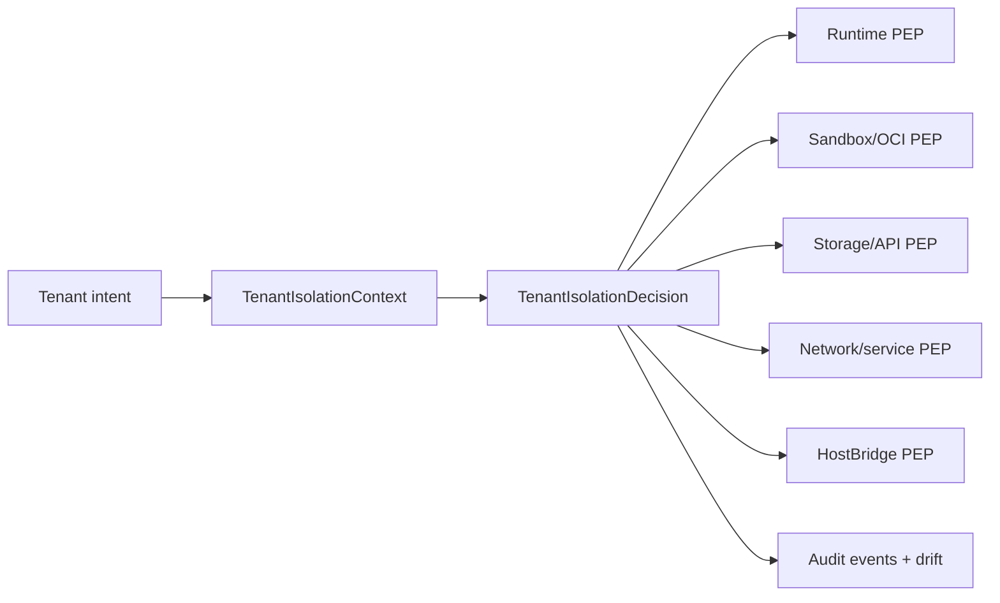

# Tenant Isolation

Nimbus treats tenant isolation as a control-plane contract, not as a side
effect of OCI, JavaScript isolates, or microVMs alone. A tenant workload is
admitted once at the server boundary, then every lower enforcement point
consumes the admitted `TenantIsolationDecision` or a narrow projection of it.

This document is the enterprise readiness reference for the current tenant
isolation posture. It summarizes the threat model, isolation claims, evidence,
residual risks, and review targets. Operational response steps live in the
[tenant isolation runbook](operating/tenant-isolation.md).

## Scope

In scope:

- Tenant identity, deployment generation, workload identity, and authority
  projection.
- In-process runtime admission for V8/Deno-backed JavaScript execution.
- MicroVM and container service sandbox launch admission.
- Storage/API tenant authorization, HostBridge operations, service lookup,
  network exposure, volumes, images, secrets, quotas, cleanup, audit events,
  and drift reporting.

Out of scope:

- A compromised host root account.
- Physical attacks on the operator machine or cloud host.
- Side-channel classes that require hardware-specific mitigation beyond the
  currently selected KVM, V8, Deno, Rust, kernel, and CPU stack.
- Customer application authorization bugs inside a tenant. Nimbus prevents
  cross-tenant widening; it does not replace application-level ACLs.

## Architecture Claim

Tenant-controlled intent must not lower directly into host paths, OCI mounts,
devices, network listeners, database namespaces, runtime grants, or secret
material. Nimbus must first rewrite or reject the intent through admission.



The decision envelope includes tenant ID, authority class, deployment
generation, stable workload identity, runtime policy, service grants, network
endpoints, storage namespace, volume/image/secret policy, quota reservation,
audit redactions, and a deterministic decision ID.

## Threat Model

| Threat | Control | Evidence |
| --- | --- | --- |
| Tenant swaps a path/header/bearer tenant ID to read another tenant. | Server-owned tenant admission checks principal claims and route tenant before storage/runtime calls. | `make verify-tenant-isolation-conformance` includes bearer tenant swap and native path denial scenarios. |
| Runtime code for one tenant supplies another tenant ID to HostBridge. | HostBridge uses the admitted invocation tenant and decision-derived storage/service projections. | Conformance scenarios prove tenant-b runtime reads only tenant-b data and application runtime cannot read `_nimbus`. |
| Runtime code asks for broad host capabilities in production. | `TenantIsolationMode::Production` rejects unsafe in-process grants or routes to a stronger tier before JavaScript runs. | `cargo test -p nimbus-server tenant_isolation -- --nocapture`. |
| Service launch materializes another tenant's sandbox, port, or volume. | Sandbox launch consumes a decision-derived service access projection and validates tenant/service/backend before backend launch. | Tenant isolation unit tests and conformance service/volume collision scenarios. |
| Tenant-controlled Compose input mounts host paths or exposes public ports. | Production Compose admission rejects host binds, undeclared/unsafe volumes, raw secrets, tag-only images, and non-loopback service exposure unless an explicit policy exists. | Conformance image admission scenarios and sandbox architecture docs. |
| Tenant image content attacks the host during materialization. | Production image admission requires digest-pinned images as the floor and has a provider seam for signature, provenance, and SBOM policy. | `TenantImageVerificationProvider` tests cover digest floor, unsigned, wrong identity, provenance, SBOM, and local-build rejection. |
| Existing state drifts away from the isolation contract. | Read-only drift scanner reports malformed manifests, handles, ports, routes, volume roots, and missing decision/audit anchors. | `cargo test -p nimbus-server tenant_isolation_drift -- --nocapture`. |
| Audit logs leak bearer claims or secret handles. | `TenantIsolationEvent` redacts sensitive attributes and correlation IDs by schema. | `cargo test -p nimbus-server audit_events -- --nocapture`. |

## Isolation Matrix

| Claim | Enforcing Layer | Test Evidence | Residual Risk |
| --- | --- | --- | --- |
| Tenant identity is fixed before lower seams run. | `TenantIsolationContext` to `TenantIsolationDecision`. | `tenant_isolation_decision_*` tests and conformance tenant-swap scenarios. | Future product tenant membership for native HTTP remains separate from current local-operator auth. |
| In-process runtime cannot widen production host grants. | Runtime admission and `RuntimeExecutionAdmission`. | Runtime policy admission tests. | Unsafe policies need configured fallback executors before they can run outside the in-process tier. |
| MicroVM service compute is tenant-scoped. | `SandboxServiceManager`, service registry, sandbox backend validation. | Conformance same-service-name and sandbox handle scenarios. | Host-side krun/libkrun process still carries accepted root VMM lifetime risk. |
| Network exposure is private by default. | Service grants, loopback default, patched krun/libkrun TSI bind address. | Conformance localhost denial and Linux localhost-only proof from the sandbox hardening baseline. | Public exposure policy is intentionally not admitted yet. |
| Storage/API calls cannot cross tenants by caller-supplied tenant IDs. | Server/adapters/runtime HostBridge consume admitted tenant context. | Conformance runtime storage and bearer-swap scenarios. | External storage providers still require correct provider namespace configuration. |
| Named volumes are tenant-owned and host binds are denied by default. | Compose admission and sandbox mount materialization. | Conformance same-named-volume scenario. | Shared read-only artifact policy is future work. |
| Images are immutable at the production floor. | Image admission policy and provider seam using maintained OCI reference parsing. | Image admission unit tests plus production Compose admission tests. | Full Sigstore/Cosign/SLSA/SBOM verification is owned by `docs/plans/artifact-provenance-verification-plan.md` and not wired to a concrete provider yet. |
| Secrets do not materialize ambiently. | Secret policy records handles/counts, not raw values; raw Compose secrets fail closed. | Tenant audit record and production Compose tests. | Dedicated secret provider integration is tracked separately; provider-auth credentials must consume `docs/plans/service-identity-provider-auth-plan.md`. |
| Per-tenant resource reservation exists before launch. | Runtime budgets, sandbox quota policy, OCI resource quota manager. | EIH5 minicloud cgroup memory proof and sandbox quota tests. | Hard disk write caps require filesystem/project-quota support. |
| Cleanup cannot delete another tenant's artifacts. | Tenant-rooted sandbox state, volumes, and storage deletion path. | Conformance cleanup scenarios. | Manual host edits outside Nimbus remain an operator responsibility. |
| Audit and drift evidence is tenant-safe. | `TenantIsolationEvent` schema and drift scanner. | Audit event and drift scanner tests. | Event transport/export backend is intentionally separate from the schema. |

## Evidence Commands

Run these before changing tenant isolation, runtime admission, sandbox launch,
storage/API tenant authorization, HostBridge operations, image admission, or
drift scanning:

```sh
cargo test -p nimbus-server tenant_isolation -- --nocapture
cargo test -p nimbus-server tenant_isolation_drift -- --nocapture
cargo test -p nimbus-server audit_events -- --nocapture
make verify-tenant-isolation-conformance
cargo fmt --all --check
cargo clippy -p nimbus-server --all-targets
```

For Linux hard-quota evidence on a cgroup v2 host:

```sh
bash scripts/prove-linux-cgroup-memory-limit.sh
```

## Residual Risks

Accepted for the current baseline:

- The host-side krun/libkrun VMM process can require root for its lifetime on
  the validated stack. Track non-root `/dev/kvm` or post-initialization
  privilege-drop research before treating this as closed.
- Hard disk write caps are admission/reservation-backed today. A future disk
  quota driver should use project quotas, quota-backed volumes, or an
  equivalent platform primitive.
- Full cryptographic image verification is represented by the
  `TenantImageVerificationProvider` seam. Production deployments that require
  signatures, attestations, or SBOMs must wire battle-tested tooling behind it
  through `docs/plans/artifact-provenance-verification-plan.md`.
- Arbitrary guest egress from process-capable microVM, browser, or agent
  sandboxes is not yet L7/SSRF mediated by a sandbox-local proxy. Current
  production controls are private-by-default service exposure, tenant-scoped
  service grants, and broad runtime-network rejection. The follow-on owner is
  `docs/plans/enterprise-policy-and-sandbox-egress-plan.md`.
- `TenantIsolationEvent` is the canonical internal event schema. OCSF and
  OpenTelemetry export mappings are deferred to
  `docs/plans/enterprise-policy-and-sandbox-egress-plan.md`.
- Secret provider authentication is not complete until
  `docs/plans/service-identity-provider-auth-plan.md` can mint short-lived,
  tenant-scoped credentials from admitted `TenantWorkloadStableIdentity`
  projections, using stable provider subjects plus signed decision and
  invocation claims.
- Native HTTP tenant membership is not a general customer auth model yet. The
  current native API is a local-operator surface guarded by local admin auth.
- Audit event schema is stable, but export routing and retention policy are
  still operator/product choices.

## External Review Targets

Prioritize external security review in this order:

1. Tenant admission and PDP/PEP split:
   `crates/nimbus-server/src/tenant_isolation.rs` and
   `crates/nimbus-server/src/tenant_isolation/audit_events.rs`.
2. Runtime HostBridge and capability execution:
   `crates/nimbus-server/src/runtime_host/` and adapter HostBridge code.
3. Sandbox launch and OCI materialization:
   `crates/nimbus-sandbox/`, `nimbus-crun`, and `nimbus-libkrun`.
4. Artifact provenance verification:
   `TenantImageVerificationProvider` plus concrete Cosign/SLSA/SBOM backends
   from `docs/plans/artifact-provenance-verification-plan.md`.
5. Service identity and provider auth:
   `TenantWorkloadStableIdentity` projections, stable provider subjects, and
   short-lived credential minting from
   `docs/plans/service-identity-provider-auth-plan.md`.
6. Storage provider namespace isolation:
   `crates/nimbus-storage/` plus provider topology docs.
7. Conformance and drift evidence:
   `scripts/verify-tenant-isolation-conformance.sh`,
   `crates/nimbus-server/src/tenant_isolation_drift.rs`, and the minicloud
   cgroup proof.

## References

- [Tenant isolation runbook](operating/tenant-isolation.md)
- [Server auth and runtime trust](architecture/server/auth-runtime-trust.md)
- [MicroVM service baseline](architecture/sandbox/microvm-service-baseline.md)
- [Artifact provenance verification plan](plans/artifact-provenance-verification-plan.md)
- [Service identity and provider auth plan](plans/service-identity-provider-auth-plan.md)
- [Verification architecture](architecture/testing/verification-architecture.md)
- [Completed tenant-isolation control-plane plan](plans/archive/tenant-isolation-control-plane-plan.md)
- [Enterprise hardening prior-art research](plans/research/tenant-isolation-enterprise-hardening-prior-art.md)
- [OpenShell competitor analysis](plans/research/openshell-competitor-analysis.md)
- [Enterprise policy and sandbox egress plan](plans/enterprise-policy-and-sandbox-egress-plan.md)
